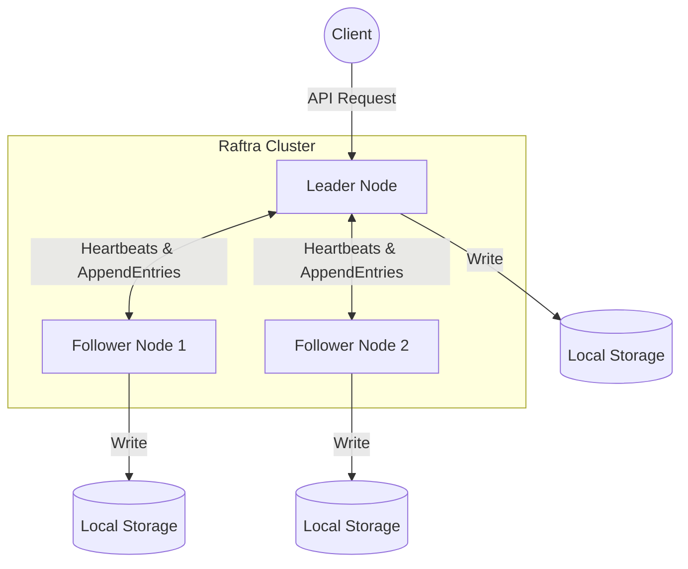

# Raftra

**A Fault-Tolerant Distributed Key-Value Store Built from Scratch**

Raftra is an educational, heavily-tested distributed key-value store implemented in Go. It uses the Raft consensus algorithm to maintain strong consistency across a cluster of nodes, ensuring that the system remains available and correct even in the face of node crashes, network partitions, and message delays.

The primary focus of this project is **correctness and fault tolerance**. It is designed to demonstrate a rigorous, ground-up implementation of a complex distributed systems protocol rather than relying on existing databases or consensus libraries.

---

## 🎯 Project Objectives

1.  **Understandable Consensus**: Implement the Raft consensus algorithm (as described in the original paper by Diego Ongaro and John Ousterhout) from scratch.
2.  **Absolute Correctness**: Prioritize safety and consistency above all else. A partitioned minority must never commit conflicting writes.
3.  **Resilience**: The system must gracefully handle leader failures, follower crashes, and network partitions, and automatically recover when nodes are brought back online.
4.  **Observability**: Provide insights into the cluster's health through structured logging and metrics.

---

## 🏗️ Architecture

Raftra operates as a distributed cluster (typically 3 or 5 nodes). Clients interact with the cluster via an API, sending commands (like `SET` or `GET`).

### Core Components per Node

Every node in the Raftra cluster contains the following distinct layers:

1.  **Transport Layer**: Handles inter-node communication (RPCs) and client requests.
2.  **Consensus Engine (Raft)**: The brain of the node. Manages state transitions (Follower → Candidate → Leader), leader election timers, and log replication logic.
3.  **Log & Storage Layer**: A persistent, durable storage backend. It explicitly separates volatile state (like the commit index) from persistent state (like the current term, voted-for candidate, and the append-only log).
4.  **State Machine (KV Store)**: An in-memory key-value map. It strictly applies operations only *after* they have been committed by the Raft consensus engine.

---

## ⚙️ How It Works

### Leader Election
When the cluster starts, all nodes begin as **Followers**. If a Follower does not receive a heartbeat from a Leader within a randomized timeout window, it transitions to a **Candidate**, votes for itself, and requests votes from the rest of the cluster. If it receives a majority of votes, it becomes the new **Leader**.

### Log Replication
All client modifications (e.g., setting a key) must be sent to the Leader. The Leader appends the command to its local log and sends it to all Followers. Only when a majority of Followers acknowledge receiving the log entry does the Leader consider it **committed**.

### Application to State Machine
Once an entry is committed, the Leader applies it to its local Key-Value State Machine and returns a success response to the client. Followers are notified of the commit index in subsequent heartbeats and apply the entries to their own state machines, keeping the whole cluster in sync.

---

## 🛡️ Fault Tolerance & Chaos Testing

Raftra is built to survive the unpredictable nature of distributed networks. The project includes an automated chaos-testing harness that continuously verifies the system against the following failure scenarios:

*   **Leader Crash**: The leader is abruptly killed. The remaining followers must detect the failure and elect a new leader seamlessly.
*   **Follower Crash**: A follower goes offline. The leader must continue processing writes as long as a majority (quorum) remains available.
*   **Network Partitions**: A subset of nodes is isolated from the rest. The majority side must continue operating, while the minority side must safely halt commits to prevent brain-split scenarios.
*   **Crash Recovery**: Dead nodes are restarted. They must read their persistent state from disk, reconnect to the current leader, backfill any missed log entries, and safely rejoin the active cluster.

---

## 🛠️ Technology Stack

*   **Language**: Go
*   **Communication**: gRPC & Protocol Buffers (for both inter-node Raft RPCs and Client operations)
*   **Persistence**: Bbolt (a transactional, B+ tree key/value store used for durable log storage)
*   **Deployment**: Docker & Docker Compose
*   **Observability**: Prometheus metrics & standard structured logging (`log/slog`)

---

## 🚀 Development Phases

The project is structured into incremental, verifiable phases:

1.  **Foundation**: Project skeleton, gRPC interfaces, and node lifecycle.
2.  **Leader Election**: Timers, vote requesting, and term management.
3.  **Log Replication**: AppendEntries logic, conflict resolution, and majority commitment.
4.  **Persistence**: Durable storage for terms, votes, and log entries to survive restarts.
5.  **Failure Testing**: Implementing the chaos harness to prove correctness under duress.
6.  **Deployment**: Dockerization and CLI tool creation.
7.  **Observability**: Benchmarks and metrics generation.
