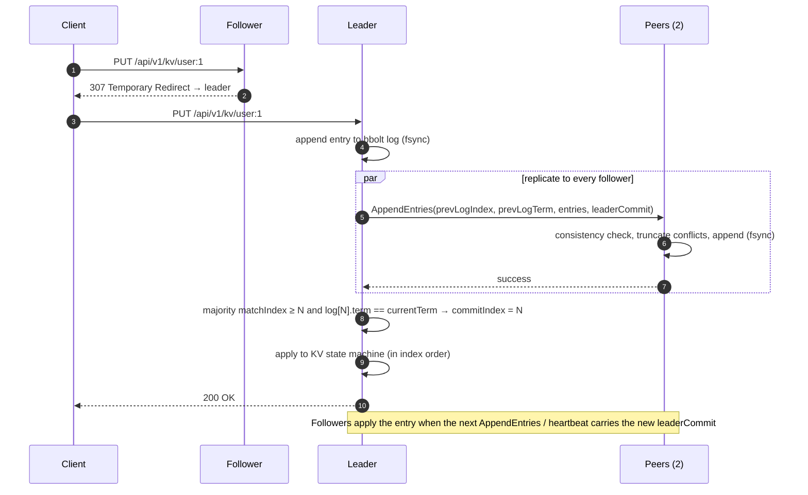

# Raftra

**A fault-tolerant, strongly-replicated key-value store in Go, powered by a from-scratch implementation of the Raft consensus algorithm.**


-orange)


**[Watch the live playground](https://shantanu-1607.github.io/Raftra/)** A public 3-node cluster loses its leader every ten minutes, and the page shows it recover in real time. You can also break a simulated cluster in your browser.

Raftra replicates every write across a cluster of nodes, so the store keeps serving as long as a majority of nodes are up. A leader can crash, a follower can die, or the network can split, and the data stays correct. The consensus engine (elections, log replication, conflict resolution, crash recovery) is written by hand from the [Raft paper](https://raft.github.io/raft.pdf). No Raft library is imported.

| **5,842 ops/s** | **20.8 ms** | **245 ms** | **0 errors** |
| :---: | :---: | :---: | :---: |
| sustained throughput over 1M ops<sup>†</sup> | p50 quorum-replicated write<sup>†</sup> | average leader failover (20 trials) | across 1,010,000 load-test ops |

<sub>† 3-node cluster on one MacBook, 100 concurrent HTTP clients, 80% writes, fsync disabled (`-nosync`). With full fsync durability on macOS the same cluster does 93.7 ops/s. See <a href="#-benchmarks">Benchmarks</a> for the full numbers and why they differ.</sub>

---

## Contents

- [Highlights](#-highlights)
- [Architecture](#%EF%B8%8F-architecture)
- [Quick Start](#-quick-start)
- [API Reference](#-api-reference)
- [Configuration](#%EF%B8%8F-configuration)
- [Benchmarks](#-benchmarks)
- [Testing & Chaos Engineering](#-testing--chaos-engineering)
- [Correctness Guarantees](#%EF%B8%8F-correctness-guarantees)
- [Design Notes & Known Limitations](#-design-notes--known-limitations)
- [Project Structure](#-project-structure)
- [Roadmap](#%EF%B8%8F-roadmap)

---

## ✨ Highlights

- **Raft built from scratch.** Randomized election timeouts, term-based step-down, the log up-to-date voting rule (§5.4.1), `nextIndex` backoff for divergent logs, the "only commit entries from your own term" rule (§5.4.2) with a no-op entry on every election win (§8), and pre-vote (thesis §9.6) so a node that cannot hear the leader does not disrupt it.
- **Durable by default.** `currentTerm`, `votedFor` and every log entry are written to an embedded [bbolt](https://github.com/etcd-io/bbolt) B+tree before an RPC is acknowledged. Nodes recover their state from disk after a crash.
- **Two client APIs.** gRPC (`KVService`) and an HTTP/JSON gateway. Followers answer writes with `307 Temporary Redirect` to the leader.
- **Chaos-tested.** An in-memory `ChaosNetwork` cuts virtual cables, isolates nodes and simulates power loss. Eight scenarios run on every `make test`, including split-brain, a full cluster blackout and a follower that cannot hear the leader.
- **Observable.** 12 Prometheus metrics on `/metrics` (term, role, elections, commit index, replication latency histogram and more), plus structured `log/slog` logs.
- **Batteries included.** An interactive CLI with leader-redirect handling, an HTTP load generator with p50/p95/p99 reporting, Go microbenchmarks, a failover-time benchmark, and a 3-node Docker Compose cluster.

---

## 🏗️ Architecture

```text
                    ┌──────────────────────────────────────┐
                    │   Clients: raftra-cli · curl · gRPC  │
                    └───────────────┬──────────────────────┘
                                    │  HTTP :800x  /  gRPC :5005x
                                    │  writes to a follower → 307 to leader
          ┌─────────────────────────▼──────────────────────────┐
          │                   Raftra Cluster                    │
          │                                                     │
          │               ┌─────────────────────┐               │
          │               │   node1 · LEADER    │               │
          │               │  HTTP gw  │  gRPC   │               │
          │               │  Raft consensus     │               │
          │               │  KV state machine   │               │
          │               │  bbolt (term/vote/  │               │
          │               │         log)        │               │
          │               └───┬─────────────┬───┘               │
          │   AppendEntries   │             │   AppendEntries   │
          │   + heartbeats    │             │   + heartbeats    │
          │   (every 50 ms)   ▼             ▼                   │
          │   ┌─────────────────────┐   ┌─────────────────────┐ │
          │   │  node2 · FOLLOWER   │   │  node3 · FOLLOWER   │ │
          │   │  Raft · KV · bbolt  │   │  Raft · KV · bbolt  │ │
          │   └─────────────────────┘   └─────────────────────┘ │
          └─────────────────────────────────────────────────────┘
```

### Node internals

Each node is one process built from four layers:

| Layer | Package | Responsibility |
| :--- | :--- | :--- |
| **Transport** | `internal/transport` | gRPC server and client for node-to-node Raft RPCs. Client-facing gRPC `KVService`. HTTP REST gateway with 307 leader redirects and `/metrics`. |
| **Consensus engine** | `internal/raft` | Follower/Candidate/Leader roles, terms, elections, log replication, commit tracking. One event-loop goroutine driven by election and heartbeat timers. |
| **Persistence** | `internal/storage` | `StorageBackend` interface. The bbolt implementation keeps `meta` (term, vote) and `log` (big-endian index → protobuf entry) buckets. An in-memory implementation is used in tests. |
| **State machine** | `internal/kvstore` | `map[string]string` behind a `sync.RWMutex`. It changes only when the Raft engine applies a committed entry, and entries are applied in log order. |

### Life of a write


```mermaid
sequenceDiagram
    autonumber
    participant C as Client
    participant F as Follower
    participant L as Leader
    participant P as Peers (2)

    C->>F: PUT /api/v1/kv/user:1
    F-->>C: 307 Temporary Redirect → leader
    C->>L: PUT /api/v1/kv/user:1
    L->>L: append entry to bbolt log (fsync)
    par replicate to every follower
        L->>P: AppendEntries(prevLogIndex, prevLogTerm, entries, leaderCommit)
        P->>P: consistency check, truncate conflicts, append (fsync)
        P-->>L: success
    end
    L->>L: majority matchIndex ≥ N and log[N].term == currentTerm → commitIndex = N
    L->>L: apply to KV state machine (in index order)
    L-->>C: 200 OK
    Note over L,P: Followers apply the entry when the next AppendEntries / heartbeat carries the new leaderCommit
```

### Failure handling

| Failure | What happens |
| :--- | :--- |
| **Leader crashes** | Followers stop receiving heartbeats and time out after 150–300 ms (randomized). One becomes a candidate, wins a majority, and starts serving writes. In-flight proposals on the old leader fail with `ErrNotLeader`. |
| **Follower crashes** | The leader keeps committing with the remaining majority. When the follower restarts, it reloads term, vote and log from bbolt, and the leader backfills the missing entries. |
| **Network partition** | The majority side elects or keeps a leader and continues. The minority side cannot reach quorum, so it commits nothing and its writes fail or time out. After healing, stale nodes see the higher term, step down, and truncate any divergent entries. |
| **Full blackout** | Every node reloads its persisted state, a leader is elected, and committed data is still there. Scenario 6 tests this with 100 keys. |

---

## 🚀 Quick Start

### Prerequisites

- **Go 1.26+** (see `go.mod`)
- `protoc` with `protoc-gen-go` and `protoc-gen-go-grpc`, only if you change `proto/raft.proto`
- Docker with Compose v2, only for the containerized cluster

### 1. Build

```bash
make build
# → bin/raftra-server   (cluster node)
# → bin/raftra-cli      (interactive client)
# → bin/raftra-loadgen  (HTTP load generator)
```

### 2a. Run a 3-node cluster locally

Open three terminals:

```bash
# Terminal 1
./bin/raftra-server -id node1 -port 50051 -http-port 8001 -data-dir data1 \
  -peers node2:localhost:50052,node3:localhost:50053 \
  -http-peers node2:http://localhost:8002,node3:http://localhost:8003

# Terminal 2
./bin/raftra-server -id node2 -port 50052 -http-port 8002 -data-dir data2 \
  -peers node1:localhost:50051,node3:localhost:50053 \
  -http-peers node1:http://localhost:8001,node3:http://localhost:8003

# Terminal 3
./bin/raftra-server -id node3 -port 50053 -http-port 8003 -data-dir data3 \
  -peers node1:localhost:50051,node2:localhost:50052 \
  -http-peers node1:http://localhost:8001,node2:http://localhost:8002
```

Add `-nosync` to every node to skip disk fsync. It is much faster but **not crash-safe**, so use it only for benchmarking.

### 2b. Or run it with Docker Compose

```bash
make docker-up     # builds the image and starts node1–node3
make docker-down   # stops the cluster and deletes its volumes
```

| Node | HTTP gateway | gRPC |
| :--- | :--- | :--- |
| node1 | `localhost:8001` | `localhost:50051` |
| node2 | `localhost:8002` | `localhost:50052` |
| node3 | `localhost:8003` | `localhost:50053` |

### 3. Talk to the cluster

**Interactive CLI.** It follows 307 redirects to the leader automatically, including Docker hostnames:

```text
$ ./bin/raftra-cli
● raftra ❯ status
● raftra ❯ set user:1 "Ada Lovelace"
● raftra ❯ get user:1
● raftra ❯ delete user:1
```

One-off commands work too: `./bin/raftra-cli --addr http://localhost:8002 get user:1`.

`--addr` accepts a comma-separated list, e.g. `--addr http://localhost:8001,http://localhost:8002,http://localhost:8003`. The CLI tries the nodes in order and moves on when one is down or mid-election (HTTP 502/503/504), retrying for up to about 3 seconds. Playground limits come back as plain-language messages.

**Prebuilt CLI.** Every tagged release publishes `raftra-cli` for macOS, Linux and Windows on the [Releases page](https://github.com/shantanu-1607/Raftra/releases). On macOS or Linux:

```bash
curl -fsSL https://raw.githubusercontent.com/shantanu-1607/Raftra/main/site/install.sh | sh
```

Release builds connect to the public playground cluster by default. Pass `--addr` to use your own cluster. On macOS, if you download the archive with a browser instead, clear the quarantine flag first: `xattr -d com.apple.quarantine raftra-cli`.

**curl:**

```bash
curl -L -X PUT  localhost:8001/api/v1/kv/greeting -d 'hello raft'   # -L follows the 307 to the leader
curl            localhost:8001/api/v1/kv/greeting
curl -L -X DELETE localhost:8001/api/v1/kv/greeting
curl            localhost:8001/status
```

```json
{"role":"Leader","term":3,"is_leader":true,"leader_id":"node1","commit_index":42,"last_applied":42}
```

> [!NOTE]
> In Docker, redirect `Location` headers use container hostnames such as `http://node2:8001`, which your host can't resolve. Use `raftra-cli` (it rewrites them to `localhost:800x`), or send writes straight to the leader shown by `/status`.

For a guided tour that includes killing the leader live, see **[DEMO_WALKTHROUGH.md](DEMO_WALKTHROUGH.md)**.

---

## 📡 API Reference

### HTTP gateway (every node, `-http-port`)

| Method | Path | Semantics | Success | Other responses |
| :--- | :--- | :--- | :--- | :--- |
| `GET` | `/api/v1/kv/{key}` | Read from this node's local state machine | `200` `{"key","value"}` | `404` key not found |
| `PUT` | `/api/v1/kv/{key}` | Upsert. The raw request body is the value. Waits for quorum commit. | `200` | `307` to leader · `503` no leader · `500` commit error/timeout |
| `POST` | `/api/v1/kv/{key}` | Create only if the key doesn't exist (SETNX-style) | `201` | `409` key exists · `307` · `503` · `500` |
| `DELETE` | `/api/v1/kv/{key}` | Delete through consensus | `200` `{"deleted"}` | `307` · `503` · `500` |
| `GET` | `/status` | Role, term, leader, commit and apply indices | `200` | — |
| `GET` | `/metrics` | Prometheus exposition format | `200` | — |

When playground limits are enabled (see [Configuration](#%EF%B8%8F-configuration)), writes can also return `413` (key or value too large), `429` (rate limited) or `507` (store full). Limits are enforced by the node that proposes the write, i.e. the leader.

### gRPC (every node, `-port`), defined in [`proto/raft.proto`](proto/raft.proto)

| Service | RPCs | Notes |
| :--- | :--- | :--- |
| `RaftService` | `RequestVote`, `AppendEntries` | Node-to-node only. Messages follow Figure 2 of the Raft paper. |
| `KVService` | `Set`, `Get`, `Delete` | Must be sent to the leader. For `Set` and `Delete`, a follower replies `success=false` and puts the leader's ID in `leader_hint`. A follower answers `Get` with `error: "not leader"`. |

---

## ⚙️ Configuration

### `raftra-server` flags

| Flag | Default | Description |
| :--- | :--- | :--- |
| `-id` | `node1` | Unique node ID |
| `-host` | `0.0.0.0` | Bind address for both servers |
| `-port` | `50051` | gRPC port (Raft and KV services) |
| `-http-port` | `8001` | HTTP gateway port |
| `-peers` | — | Comma-separated `id:host:port` (or `id:port` when the ID is also the hostname, as in Docker) |
| `-http-peers` | — | Comma-separated `id:http://host:port`, used to build 307 redirect targets |
| `-data-dir` | `data` | Directory for `<id>.db` (bbolt) |
| `-nosync` | `false` | Disable bbolt fsync (benchmark mode, not crash-safe) |
| `-max-key-bytes` | `0` (off) | Reject writes whose key is longer than this (→ `413`) |
| `-max-value-bytes` | `0` (off) | Reject `PUT`/`POST` bodies larger than this (→ `413`) |
| `-max-keys` | `0` (off) | Reject writes that would add a new key once the store is full (→ `507`). Overwrites and deletes still work. |
| `-write-rate` | `0` (off) | Writes per second allowed per client IP (→ `429` with `Retry-After: 1`) |
| `-write-burst` | `0` | Burst size for `-write-rate` (`0` = `ceil(write-rate)`) |
| `-trust-proxy` | `false` | Identify clients by `X-Forwarded-For`. Only enable this behind a trusted reverse proxy such as Caddy. |
| `-cors-origin` | — | `Access-Control-Allow-Origin` value for `GET /status`, so a web page can read cluster status |

### Raft timing (`raft.DefaultConfig`)

| Parameter | Value |
| :--- | :--- |
| Election timeout | 150–300 ms, randomized per reset |
| Heartbeat interval | 50 ms (the test harness uses 30 ms) |
| Outbound RPC timeout | 100 ms |
| Client proposal timeout | 5 s, then `ErrCommitTimeout` |

---

## 📊 Benchmarks

Raftra has three benchmark suites:

| Suite | Command | Path exercised |
| :--- | :--- | :--- |
| **HTTP load generator** | `bin/raftra-loadgen` | Real cluster end to end: HTTP → 307 redirect → gRPC replication → bbolt |
| **Go microbenchmarks** | `make bench` | Raft engine and real bbolt (fsync on) over the in-memory chaos transport |
| **Failover benchmark** | `make bench-failover` | Leader crash → re-election → first committed write, 10 trials |

### Load generator results

**Environment:** 3-node cluster and the load generator on one MacBook (localhost), 100 concurrent workers, 80% SET / 20% GET (`-ratio=80:20` is SET:GET) over a 1,000-key keyspace. Raw output is in [`benchmark_results.md`](benchmark_results.md).

#### Test 1: 1,000,000 operations, benchmark mode (`-nosync`)

```bash
./bin/raftra-loadgen -ops=1000000 -concurrency=100 -ratio=80:20 -addr=http://localhost:8001
```

| Metric | Total | SET (quorum-replicated) | GET (in-memory read) |
| :--- | ---: | ---: | ---: |
| Operations | 1,000,000 | 800,094 | 199,906 |
| Throughput | **5,842.3 ops/s** | 4,674.4 ops/s | 1,167.9 ops/s |
| p50 latency | | **20.84 ms** | **93.92 µs** |
| p95 latency | | 30.95 ms | 530.08 µs |
| p99 latency | | 40.23 ms | 1.48 ms |
| Min / Max | | 449.50 µs / 227.87 ms | 28.25 µs / 101.65 ms |
| Errors | **0 (0.00%)** | | |
| Wall time | 171.17 s | | |

#### Test 2: 10,000 operations, durable mode (default fsync)

```bash
./bin/raftra-loadgen -ops=10000 -concurrency=100 -ratio=80:20 -addr=http://localhost:8001
```

| Metric | Total | SET (quorum-replicated) | GET (in-memory read) |
| :--- | ---: | ---: | ---: |
| Operations | 10,000 | 7,986 | 2,014 |
| Throughput | **93.7 ops/s** | 74.8 ops/s | 18.9 ops/s |
| p50 latency | | **1,323.76 ms** | **158.21 µs** |
| p95 latency | | 1,539.16 ms | 2.50 ms |
| p99 latency | | 1,774.95 ms | 7.61 ms |
| Min / Max | | 138.05 ms / 2,152.76 ms | 54.08 µs / 11.75 ms |
| Errors | **0 (0.00%)** | | |
| Wall time | 106.76 s | | |

#### Durable vs. benchmark mode

| Metric | Durable (fsync) | `-nosync` | Speedup |
| :--- | ---: | ---: | ---: |
| Throughput | 93.7 ops/s | 5,842.3 ops/s | **62×** |
| SET p50 | 1,323.76 ms | 20.84 ms | **63×** |
| SET p99 | 1,774.95 ms | 40.23 ms | **44×** |
| GET p50 | 158.21 µs | 93.92 µs | 1.7× |
| Error rate | 0% | 0% | — |

#### What the numbers mean

- **Disk sync dominates durable writes.** Only the fsync setting changes between the two runs, and throughput moves 62×. Each proposal is its own bbolt transaction, so before a write can commit it pays at least one disk sync on the leader and one on a follower. On macOS, Go's `File.Sync` issues `F_FULLFSYNC`, which flushes the drive's write cache and takes milliseconds per call.
- **Writes serialize on the leader.** `ProposeCommand` appends to disk while holding the node mutex. With 100 concurrent clients, durable SETs queue behind each other's syncs. That is why the SET p50 reaches ~1.3 s while GETs on the same cluster stay under a millisecond. The biggest available speedup is group commit: batch every pending proposal into one bbolt transaction and one fsync. This is not implemented yet.
- **Reads are cheap in both modes.** GETs never touch the log or the disk. They are a read-locked map lookup on whichever node gets the request, so they stay sub-millisecond at p50.
- **Zero errors across 1.01M operations.** No request failed, timed out or got lost while the cluster was saturated.
- On Linux with NVMe storage, fsync usually costs a fraction of a millisecond, so durable mode should land much closer to the `-nosync` numbers. This hasn't been measured for Raftra yet.

### Go microbenchmarks (`make bench`)

These run a real 3-node cluster in-process with the [chaos harness](test/chaos/harness.go): real bbolt with fsync on, and RPCs delivered through the in-memory `ChaosNetwork`. There is no gRPC or HTTP overhead, so they isolate the consensus and storage cost.

**Environment:** Apple M2 (8 cores), 8 GB RAM, macOS, Go 1.26.4. Each benchmark ran 3 times (`-count=3`). Raw output is in [`benchmark_results.md`](benchmark_results.md).

| Benchmark | What it measures | Mean (3 runs) | Rate | Memory | Spread |
| :--- | :--- | ---: | ---: | :--- | ---: |
| `BenchmarkSetOperation` | One write at a time: `Propose` → quorum commit → apply | **14.83 ms/op** | ~67 writes/s | 161 KB, 881 allocs/op | 7.5% |
| `BenchmarkGetOperation` | Read a committed key from the leader's state machine | **29.36 ns/op** | ~34 M reads/s | 0 B, 0 allocs | 0.8% |
| `BenchmarkMixedWorkload` | `b.RunParallel` on 8 procs, 80% reads / 20% quorum writes | **2.69 ms/op** | ~372 ops/s | 37 KB, 190 allocs/op | 19.7% |
| `BenchmarkReplicationLatency` | Proposal → majority commit, as `us/quorum-commit` | **15.58 ms** | — | 161 KB, 884 allocs/op | 9.5% |

**What they tell us:**

- **A durable quorum write takes about 15 ms on macOS** with no network in the path. The leader syncs its log to disk before it replicates, and a follower syncs before it acknowledges, so each commit pays for two disk syncs one after the other. The load generator's ~1.3 s durable p50 comes from 100 clients queueing behind that serialized path, not from slow individual writes.
- **Reads are almost free.** A read is a read-locked map lookup: 29 ns with zero allocations, more than 500,000× cheaper than a write.
- **Writes are the bottleneck in mixed workloads.** At 20% writes, throughput is capped by the serialized write path. Group commit is the lever.
- **About 160 KB and 880 allocations per write.** This includes background heartbeats and the harness's debug logging, because `-benchmem` counts every allocation in the process. Likely contributors are protobuf unmarshalling on every bbolt read in the replication path (`GetEntry`, `GetEntriesFrom`), gob encoding, and log formatting. This hasn't been profiled yet.

### Failover benchmark (`make bench-failover`)

`TestFailoverTimeMeasurement` runs **10 independent trials**. Each trial:

1. Starts a fresh 3-node cluster, waits for a leader, and commits a warm-up write.
2. Records **T1** and crashes the leader: stops its event loop, closes its database, and cuts it off the network.
3. Retries a new write until a new leader commits it, then records **T2**.

**Failover time = T2 − T1.** This includes failure detection (election timeout), the election, and one full quorum commit. The test reports min, max and average, and **fails if the average exceeds 2.0 s**. Before the crash, the test waits for the warm-up write to reach every node and then targets the highest-term leader, so it never "crashes" a leader that was already deposed.

**Results** (2 passes × 10 trials, Apple M2, macOS, Go 1.26.4, recorded 2026-10-03 with pre-vote and the no-op entry):

| Metric | Pass 1 | Pass 2 | All 20 trials |
| :--- | ---: | ---: | ---: |
| Average | 243 ms | 247 ms | **245 ms** |
| Median | | | **243 ms** |
| Min | 207 ms | 205 ms | 205 ms |
| Max | 291 ms | 281 ms | 291 ms |

Every failover finished in 205–291 ms, which is the 150–300 ms randomized election timeout plus a pre-vote round and one quorum commit. The earlier measurement (322 ms average, 191–611 ms) had occasional 460–611 ms trials from a second election round; ignoring stale election-timer fires removed those. The average is **about 8× under the 2-second requirement**.

### Live metrics (Prometheus)

Every node exposes `GET /metrics`:

| Metric | Type | Meaning |
| :--- | :--- | :--- |
| `raft_current_term` | gauge | Current term |
| `raft_node_role` | gauge | 0 = Follower, 1 = Candidate, 2 = Leader |
| `raft_leader_elections_total` | counter | Elections started by this node |
| `raft_commit_index` | gauge | Highest committed index |
| `raft_last_applied` | gauge | Highest index applied to the KV map |
| `raft_log_entries_total` | gauge | Entries in the Raft log |
| `raft_replication_latency_seconds` | histogram | Leader proposal → majority commit (1 ms–5 s buckets) |
| `raft_append_entries_total` | counter | AppendEntries RPCs sent (replication and heartbeats) |
| `raft_request_vote_total` | counter | RequestVote RPCs sent, pre-votes included |
| `kv_requests_total{type}` | counter | HTTP KV requests by method |
| `kv_request_duration_seconds{type}` | histogram | HTTP KV latency by method (0.5 ms–1 s buckets) |
| `kv_store_size` | gauge | Live keys in the state machine |

```bash
curl -s localhost:8001/metrics | grep -E '^(raft|kv)_'
```

---

## 🧪 Testing & Chaos Engineering

```bash
make test      # go test -v -race ./...  (every suite, race detector on)
```

**Last full verification (2026-10-03, Apple M2):**

| Check | Result |
| :--- | :--- |
| `make test`, all packages with `-race` | ✅ **71/71 tests pass**, no data races, ~12 s |
| Chaos scenarios ×10 (`-count=10 -race`) | ✅ **80/80 runs pass**, no flakes, ~90 s |
| `go vet ./...` | ✅ clean |
| `gofmt -l .` | ✅ clean |

| Suite | Location | Covers |
| :--- | :--- | :--- |
| **Election** (12 tests) | `internal/raft/election_test.go` | Single-node self-election, stale-term vote rejection, no double voting, log up-to-date check and tie-breaker, candidate step-down, heartbeat timer reset, stale leader rejection, term growth, pre-vote granted without state change, pre-vote refused while a leader is alive, stale election-timer fire ignored |
| **Replication** (11 tests) | `internal/raft/replication_test.go` | SET/GET/DELETE, replication to followers, majority-only commit, follower catch-up, log conflict truncation, §5.4.2 current-term commit rule (and the no-op committing older entries), non-leader rejection, ordered multi-ops, concurrent writes |
| **Persistence** (5 tests) | `internal/raft/persistence_test.go` | Term, vote and log survive a crash; no double vote after restart; follower crash and catch-up; ex-leader restarts and steps down |
| **Storage** (5 tests) | `internal/storage/bbolt_store_test.go` | Bucket and sentinel init, term and vote round-trip, append and read, truncate, durability after close |
| **Metrics** (2 tests) | `internal/metrics/metrics_test.go` | Custom registry wiring, nil-safety |
| **Chaos** (8 scenarios) | `test/chaos/scenarios_test.go` | See below |

### Chaos scenarios

The `ChaosNetwork` is an in-memory switch between nodes. It can block single links (both ways or one way), isolate nodes, partition groups and heal. Every message is `proto.Clone`d to simulate serialization, so nodes never share pointers. "Crash" stops a node and closes its bbolt file, and "restart" rebuilds the node from that file.

| # | Scenario | Fault | Assertion |
| :---: | :--- | :--- | :--- |
| 1 | **Leader crash & recovery** | Kill the leader | New leader within 2 s, old data survives, restarted ex-leader catches up |
| 2 | **Follower crash & catch-up** | Kill a follower, write 2 keys | Writes succeed on 2/3 quorum, rebooted follower backfills everything |
| 3 | **Minority partition** | Isolate one follower | Majority commits, isolated node rejects writes and doesn't see new keys, converges after heal |
| 4 | **Leader partition / split-brain** | Isolate the leader | Majority elects a new leader, old leader never receives new writes, steps down and syncs after heal |
| 5 | **Rapid cascading leader kills** | 5 nodes, kill 3 leaders in a row | With 2/5 alive **no leader is elected**. After reboot all 4 keys are intact. |
| 6 | **Full regional blackout** | Kill all 3 nodes at once | Cluster recovers from disk and all 100 keys are consistent on every node |
| 7 | **Full restart, no new writes** | Kill and restart all 3 nodes | Old data is readable on every node again **without** a new client write (the new leader's no-op commits it) |
| 8 | **Follower that cannot hear the leader** | Drop leader → follower traffic only | Same leader and same term after 1 s (pre-vote refused); the follower catches up after heal |

```bash
go test -v -race -run TestScenario ./test/chaos/...   # chaos scenarios only
```

---

## 🛡️ Correctness Guarantees

| Raft property | How Raftra enforces it |
| :--- | :--- |
| **Election Safety:** at most one leader per term | One vote per term, and `votedFor` is persisted before the vote is granted (`HandleRequestVote`). Every RPC steps down on a higher term (`checkTerm`). |
| **Leader Append-Only** | The leader only appends at `lastIndex + 1`. Only followers truncate, and only on a term conflict. |
| **Log Matching** | `AppendEntries` checks `prevLogIndex`/`prevLogTerm`, rejects mismatches, and truncates from the first conflicting entry. |
| **Leader Completeness** | Voters refuse candidates whose last log term/index is behind their own (§5.4.1). |
| **State Machine Safety** | Entries are applied strictly in index order and only up to `commitIndex`. Leaders count replicas only for entries from their current term (§5.4.2). |

**Persistence comes first.** Term, vote and log entries go to bbolt before an RPC response is returned. `commitIndex` and `lastApplied` are volatile, as in the paper: a restarted node rebuilds its KV map as the leader's `leaderCommit` arrives. Because a leader may only commit entries from its own term, every new leader appends an empty no-op entry (§8); committing it also commits everything before it, so data written in earlier terms becomes readable without waiting for a client write.

**Stable leadership.** Before a real election, a node holds a pre-vote (Raft thesis §9.6): it asks whether peers would vote for it in the next term, and nobody changes their term. Peers refuse while they still hear from a leader, so a node that was cut off, or just restarted and not yet reconnected, cannot bump the term and depose a healthy leader. Election timer fires that arrive after the timer was re-armed are ignored, and peers' gRPC connections retry at most every second, so a restarted node rejoins within about a second.

---

## 🧭 Design Notes & Known Limitations

Raftra puts correctness ahead of performance and extra features. These trade-offs are deliberate:

- **Reads are not linearizable.** HTTP `GET` is served from the local state machine of whichever node receives it, so a follower can return slightly stale data. gRPC `Get` requires the leader role but has no ReadIndex or lease check. Writes are fully replicated and safe.
- **`POST` create-if-absent is best-effort.** The leader checks whether the key exists before it proposes, so two concurrent creates of the same key can both succeed.
- **No write batching.** Each proposal is its own fsynced bbolt transaction (see [Benchmarks](#what-the-numbers-mean)).
- **AppendEntries carries at most 256 entries per RPC.** A far-behind follower catches up over several RPCs, and conflicts still back off one index at a time.
- **No snapshots or log compaction.** The log grows without bound.
- **Static membership.** The cluster is fixed at startup.
- **Command encoding** uses `encoding/gob` inside the protobuf `LogEntry.command` bytes.

### Out of scope

Dynamic membership, snapshots and log compaction, sharding, transactions or MVCC, multi-region deployment, TLS and authentication, Kubernetes, and a web dashboard.

---

## 📁 Project Structure

```text
raftra/
├── cmd/
│   ├── raftra-server/      # Node binary: flags, wiring, graceful shutdown
│   └── raftra-cli/         # Interactive REPL and one-shot client (follows 307s)
├── internal/
│   ├── raft/               # Consensus engine: raft.go (event loop), election.go,
│   │                       #   replication.go, state.go, config.go + tests
│   ├── kvstore/            # Replicated state machine and gob command encoding
│   ├── storage/            # StorageBackend interface, bbolt store, in-memory store
│   ├── transport/          # gRPC server/client/handlers, HTTP gateway
│   └── metrics/            # Prometheus collectors
├── proto/                  # raft.proto (+ generated *.pb.go, do not edit by hand)
├── test/chaos/             # ChaosNetwork, TestCluster harness, 8 fault scenarios
├── benchmark/
│   ├── bench_test.go       # Go microbenchmarks
│   ├── failover_test.go    # 10-trial failover timing
│   └── loadgen/            # HTTP load generator (p50/p95/p99)
├── deployments/            # Multi-stage Dockerfile, 3-node docker-compose.yml
├── site/                   # Landing page (GitHub Pages, no build step) and install.sh
├── test/site/              # node --test unit tests for the page's logic
├── benchmark_results.md    # Raw load-generator results
├── DEMO_WALKTHROUGH.md     # Hands-on demo: start, write, kill leader, recover
└── Makefile
```

### Make targets

| Target | Action |
| :--- | :--- |
| `make build` | Build `bin/raftra-server`, `bin/raftra-cli`, `bin/raftra-loadgen` |
| `make test` | All tests with `-race` |
| `make bench` | Go microbenchmarks with `-benchmem` |
| `make bench-failover` | 10-trial failover measurement |
| `make proto` | Regenerate gRPC/protobuf code |
| `make docker-build` / `docker-up` / `docker-down` | Container image and 3-node cluster |
| `make clean` | Remove `bin/` |

---

## 🗺️ Roadmap

| Phase | Deliverable | Status |
| :---: | :--- | :---: |
| 1 | Project skeleton, gRPC/Protobuf definitions, node lifecycle | ✅ |
| 2 | Leader election, terms, voting, heartbeats | ✅ |
| 3 | Log replication, conflict resolution, majority commit, client APIs | ✅ |
| 4 | bbolt persistence, crash recovery | ✅ |
| 5 | Automated chaos testing (crash, partition, split-brain, blackout) | ✅ |
| 6 | Docker Compose cluster, CLI with leader redirect | ✅ |
| 7 | Prometheus metrics, structured logging, benchmarks | ✅ |
| 8 | Documentation and demo walkthrough | ✅ |

**Possible next steps:** group commit and batched fsync, ReadIndex or lease-based linearizable reads, snapshots and log compaction, and joint-consensus membership changes.

---

## 📄 License

[MIT](LICENSE).
